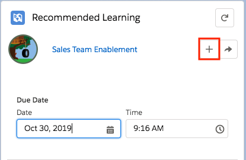
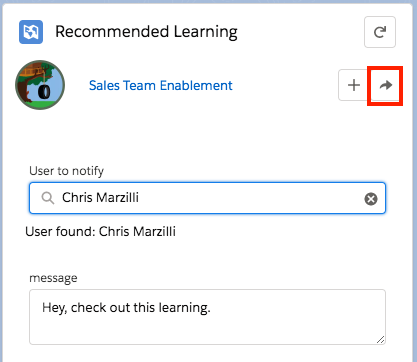
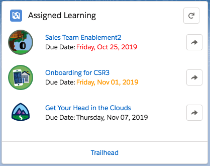
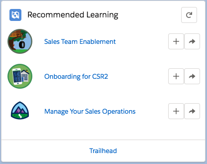
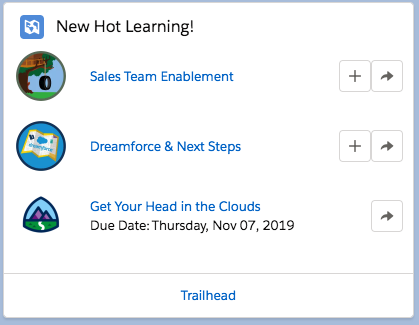
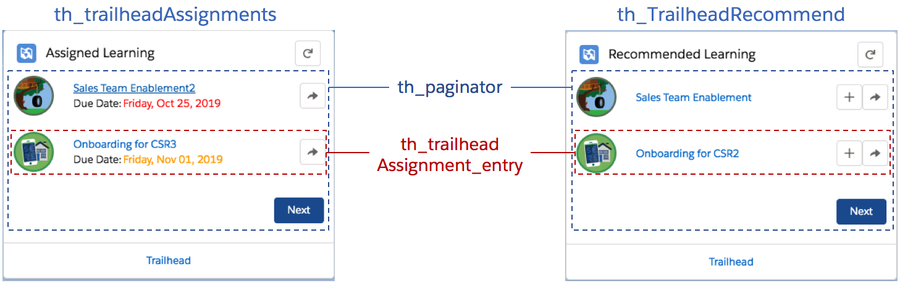

# Overview DF19 Edition
This repository provides a number of Trail Tracker customizations examples to show developers and admins how they can extend Trailhead and myTrailhead. The code within is provided as an example of what can be done and is not actively supported.

If you want to install this repository as a package in an org use one of the following URLs: 

Sandbox (Recommended):
https://test.salesforce.com/packaging/installPackage.apexp?p0=04t2E000003kUGL
Developer Edition or Production:
https://login.salesforce.com/packaging/installPackage.apexp?p0=04t2E000003kUGL

As a prerequisite be sure to have installed the latest version of the [Trail Tracker app](https://appexchange.salesforce.com/appxListingDetail?listingId=a0N3A00000EFpAtUAL) first. 

If you installed previous versions of this package you have two options to upgrade: 
 1) Unistall and reinstall - completely remove the old package from your org by uninstalling the package and deleting it from Setup > Installed Packages.  Not this will require you to remove all references to the LWCs, processes and flows first.
 2) Use DX to push updates - If you have DX installed and configured you can dowloand the source code found in the DX folder and push the enite APEX and LWCs folder to your org to update just the APEX and LWCs. Note this may break any pages where you had the LWCs..

## Whats been updated since the last version (TDX19)
* All components exposed to Communities
* New <b>Add</b> button: users can click the add button next to a badge/trailmix to add it to their list of assignments 
* New <b>Share</b> button: users can share learning by posting to chatter and @ mentioning someone
* New <b>Report Display</b> LWC: it can consume any Report that has badges or trailmixes and display them.  It gives Admins the ability to display Ad-hoq lists of Badges and Trailmixes. Admins can create reports that have badges or trailmixes and then use the LWC to display them anywhere.

<table>
 <tr><td>New Add Button:</td><td>New Share Button:</td></tr>
 <tr><td></td><td> </td></tr>
</table> 

 
Looking for the older version see here: {TBD}

# What is included
* <b>Lightning Web Components</b> to show Assignments, Recommendations, and Adhoq lists (reports) of Badges and Trailmixes
* <b>Processes</b> for creating new assignments and recommendations 
* <b>Login Flow</b> with the Assignments Lightning Web Component 
* <b>Custom Object</b> to persist Recommendations
* <b>Aura Wrapper</b> for the Assignment Lightning Web Component so it can be used with Lightning Out, Visualforce Pages and Flow
* <b>Apex Classes</b> to retrieve Trailhead Assignments/Recommendations/Reports and test classes
* <b>Custom Labels</b> to customize and integrate Trailhead Assignments / Recommendations LWCs with your myTrailhead Instance

## Assignment Component
[th\_trailheadAssignments](dx/force-app/main/default/lwc/th_trailheadAssignments) - the Lightning Web Component that shows the list of assignments.
  * supports the following design attributes:
     * Badges or Trailmixes (Badge,TrailMix,Both) - type of entries to show
     * Page Size (Integer) - the number of records to show per page
     * Warning # days until due date (Integer) - Items within this many days will have orange due dates
     * Show Share Button? - Checkbox to show or not show share button

## Recommendation Component
[th\_contextualRecommend](dx/force-app/main/default/lwc/th_contextualRecommend) - the Lightning Web Component that shows the list of recommendations stored in the TH_Recommendation__c object. On a lightning record page it will show recommendations specific to that record, on a home or app page it will show all recommendations. If there are no recommendations the component will not render. 
  * supports the following design attributes:
     * Page Size (Integer) - the number of records to show per page
     * Warning # days until due date (Integer) - Items within this many days will have orange due dates
     * Show Add Button? - Checkbox to show or not show add button
     * Show Share Button? - Checkbox to show or not show share button

## Report Display Component
[th\_ReportDisplay](dx/force-app/main/default/lwc/th_ReportDisplay) - the Lightning Web Component that shows the list of ad-hoq badges and/or trailmixes based on a report. Administrators can create a report, for example new badges created this week, and then input the report's developer name into the compoment to have it display the badges or trailmixes on the report.  To find a report's developer name run the report, click edit, click the down arrow next to the save button, click Properties and copy the "Report Unique Name" field. 
  * supports the following design attributes:
     * Component Title - Display Title of Compoment
     * Badge Report Developer Name - API name of badge report (see above paragraph for details)
     * Trailmix Report Developer Name - API name of trailmix report (see above paragraph for details)
     * Page Size (Integer) - the number of records to show per page
     * Warning # days until due date (Integer) - Items within this many days will have orange due dates
     * Show Add Button? - Checkbox to show or not show add button
     * Show Share Button? - Checkbox to show or not show share button

## Private components

* [th\_trailheadAssignment\_entry](dx/force-app/main/default/lwc/th_trailheadAssignment_entry/) - Private LWC component that represents a single badge or trailmix
* [th\_paginator\_entry](dx/force-app/main/default/lwc/th_paginator_entry/) - Private LWC component that paginates a list of th_trailheadAssignment_entry's
* [th\_trailheadAssignment\_entryAdd](dx/force-app/main/default/lwc/th_trailheadAssignment_entryAdd/) - Private LWC component that allows a user to assign learning to themselves
* [th\_trailheadAssignment\_entryShare](dx/force-app/main/default/lwc/th_trailheadAssignment_entryShare/) - Private LWC component that allows a user to share learning to others through chatter

## Component Breakdown
The assignment, recommendation and report component all leverage the private components

## Processes & Flows
The following Process and flows are included:
* Assigned Trailmix Chatter Post: Example of a chatter notification when a Trailmix is assigned
* Assign Lead Trailmix: Example of assigning a Trailmix when a Lead is updated
* Opportunity Badge Recommendation: Example of creating a recommendation when an opporutnity is updated
* TH Login Flow: Login flow that checks for uncompleted assignements and if any are found displays the Assignements LWC.  This needs to be manually assigned to a Profile.

All process are deployed as inactive.  Clone the latest version, update with a valid Badge or Trailmix Id and Activate.

### Aura Wrap Component

To allow the Assignment component to be used in places where Lightning Web Components are not yet supported (like Lightning-Out and flow), we provide a 'Wrapper component' (written in aura).  It includes the LWC component and can be used in many more areas.

* [th\_trailheadAssignments\_wrap](dx/force-app/main/default/aura/th_trailheadAssignments_wrap) - Wrapper Component
  * [Component - th\_trailheadAssignments\_wrap](dx/force-app/main/default/aura/th_trailheadAssignments_wrap/th_trailheadAssignments_wrap.cmp)

## Lightning Out

* [TH\_Assignments](dx/force-app/main/default/pages/TH_Assignments.page) - Visualforce Page using Lightning Out
  * [th\_trailheadAssignments\_container](dx/force-app/main/default/aura/th_trailheadAssignments_container) - Application to allow the component to be used in Lightning Out.

## Custom Labels

To allow the component to be easier to extend, we have created three Custom Labels to allow customization without touching code.

<table>
    <tr>
        <th>Name</th>
        <th>Description</th>
        <th>Default Value</th>
    </tr>
    <tr>
        <td>th_trailhead_link_address</td>
        <td>Address to send users to when clicking the link at the bottom of the Trailhead Assignments / Recomendations component</td>
        <td>https://trailhead.salesforce.com/</td>
    </tr>
    <tr>
        <td>th_trailhead_link_label</td>
        <td>Label for the 'Trailhead' link at the bottom of the Trailhead Assignments component</td>
        <td>Traihead</td>
    </tr>
    <tr>
        <td>th_trailhead_trail_icon</td>
        <td>Icon to show when Trailmixes are assigned (as they have no icon)</td>
        <td><a href="https://trailhead-web.s3.amazonaws.com/uploads/users/5396019/photos/thumb_030804d3576dab0cdc2a558055816208e421312a9d1495117d57928ef380d7f2.png?updatedAt=20180906113753">https://trailhead-web.s3.amazonaws.com/...</a></td>
    </tr></table>
    

# Status

* Linting
  * You can now lint everything
    * by `cd dx; npm run lint` - will lint all javascript files
    * or `cd dx; npm run lint:watch` - to repeatedly lint everything
    * or `cd dx; npm run lint:watch:changed` - or to lint when you save a file and only lint that file (neat)
* Users can share badges and trails
  * Work Remaining
     * Unit tests
     * Cleanup TODO in th_overlayShare_wrap, left an example using the standard forceChatter:publisher components and bask in the glory of how well it doesn't meet our needs.
     * Review if resizing the ContextualRecommend and trailheadAssignments makes them look funny. I manually et the width to 100% on the entries, but unsure if it works everywhere.
     * How to show errors if apex fails in `th_traiheadAssignments`, th_overlayShare or th_overlayAddAssign. Show toast message?
  * Caveats
     * So far only Badges and Trailmixes are supported. Seems complete unless we need trail.
     * Sharing seems to share to another user, although it doesn't appear to show up on their wall for some reason? (Although they get an email)
  * How was it done?
     * We need to switch the Trailhead Assignments and Recommendations components to the wrap components (they register the share and add events emitted from the `trailheadAssignment_entry` component). This was done on the home page, but not sure where else is needed.
     * Note that we leverage the overlaylibrary. This is the reason we need the wrapper as it is only supported in Aura. There was a response that [the only other option is to recreate the modal component by hand.](https://org62.lightning.force.com/lightning/r/0D50M00004S4r45SAB/view)
     * The `lwc/trailheadAssignment_entry` has the buttons that emit a custom event, note that it uses bubbles and composed. [This allows the intermediaries to not know about them or care.](https://developer.salesforce.com/docs/component-library/documentation/lwc/lwc.events_propagation)
     * The `Assignments_wrapper` / `Recommendations_wrapper` then listen for it, and then use the [aura component - lightning:overlayLibrary](https://developer.salesforce.com/docs/component-library/bundle/lightning:overlayLibrary/documentation) to then create the aura `overlayShare_wrap` component.
     * That in turn creates the lwc `overlayShare` component.
     * The Apex is in the `TH_ShareUtil` apex class to actually do the share.
     * The 'click enter' to search in the Search Input examples for [lwc lightning-input component](https://developer.salesforce.com/docs/component-library/bundle/lightning-input/example) didn't work out. So I used the timeout method done in the [lwc-recipes for CompositionContactSearch](https://github.com/trailheadapps/lwc-recipes/blob/master/force-app/main/default/lwc/compositionContactSearch/compositionContactSearch.js)
     * To test the search, either add more users, or set the [th_TrailheadMinCharSearchThreshold](https://trail-assignments-lwc-dev-ed.my.salesforce.com/one/one.app#/alohaRedirect/1012E00000AjFqn?isdtp=p1) custom label.  (This seems to cache pretty hard, manually setting might be necessary)
     * Custom Labels used: [th_TrailheadMinCharSearchThreshold](https://trail-assignments-lwc-dev-ed.my.salesforce.com/one/one.app#/alohaRedirect/1012E00000AjFqn?isdtp=p1), [th_TrailheadInputSearchDelay](https://trail-assignments-lwc-dev-ed.my.salesforce.com/one/one.app#/alohaRedirect/1012E00000AjFqs?isdtp=p1)

* User can add assignments
  * Work Remaining
     * Unit tests
     * Cleanup TODO in th_overlayShare_wrap, left an example using the standard forceChatter:publisher components and bask in the glory of how well it doesn't meet our needs.
     * Review if resizing the `ContextualRecommend` and `trailheadAssignments` makes them look funny. I manually et the width to 100% on the entries, but unsure if it works everywhere.
     * How to show errors if apex fails in `th_traiheadAssignments`, `th_overlayShare` or `th_overlayAddAssign`. Show toast message?
  * Caveats
     * None - so far
  * How was it done?
     * * We need to switch the Trailhead Assignments and Recommendations components to the wrap components (they register the share and add events emitted from the `trailheadAssignment_entry` component). This was done on the home page, but not sure where else is needed.
     * Note that we leverage the overlaylibrary. This is the reason we need the wrapper as it is only supported in Aura. There was a response that [the only other option is to recreate the modal component by hand.](https://org62.lightning.force.com/lightning/r/0D50M00004S4r45SAB/view)
     * The `lwc/trailheadAssignment_entry` has the buttons that emit a custom event, note that it uses bubbles and composed. [This allows the intermediaries to not know about them or care.](https://developer.salesforce.com/docs/component-library/documentation/lwc/lwc.events_propagation)
     * The `Assignments_wrapper` / `Recommendations_wrapper` then listen for it, and then use the [aura component - lightning:overlayLibrary](https://developer.salesforce.com/docs/component-library/bundle/lightning:overlayLibrary/documentation) to then create the aura  `overlayAddAssign_wrap` components.
     * They in turn create the lwc `overlayAddAssign` components.
     * The Apex is in the `TH_Assignments` apex class to actually add the assignment.
         * Based on the type of the entry, we call either the `addTrailheadModuleAssignment` or `the addTrailmixAssignment` method

Wishlist

* Look into the flow as a Lightning Web Component
* Look into removing the need for the wrapper components
  * the [e.force:refreshView event](https://developer.salesforce.com/docs/component-library/bundle/force:refreshView/documentation) requires aura...
     * Without this event, if we add the badge in one component, other components can't detect it, and the user would still have a '+' button.
     * However, it seems like this is an edge case and are okay with not covering this for now / will address if needed later.
     * (Possible we could leverage Application Level events to communicate between all of them, but would need more thought)
  * The standard way of showing modals (through [lightning:overlayLibrary](https://developer.salesforce.com/docs/component-library/bundle/lightning:overlayLibrary/documentation)) requires aura...
     * So instead, lets show the forms within the components instead of through overlays.
     * Current thought is that we take the iterator showing the list of entries and move that to a separate component that the Assigned Learning and Recommended Learning share. (Because its really just what items are fed to it that differs between the recommended and assigned learning)
     * When the user clicks the '+' or 'share' button, the list disappears and the respective form is shown.
     * When the user completes the form (either by cancelling or completing it), then the form disappears and the list re-appears as though nothing happened.
