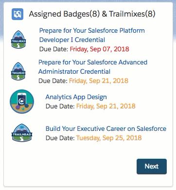
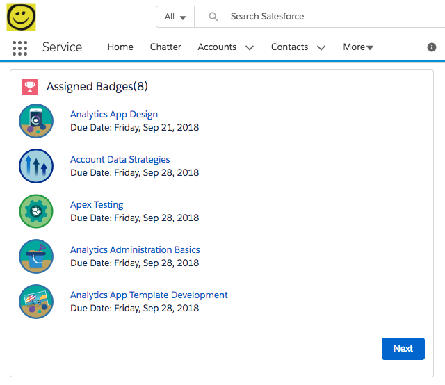
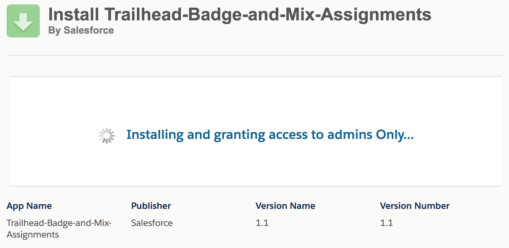

# Overview

Provide a list of the current trailhead badges and trailmixes assigned to the current user.

Done as a Home Page Component (found under the Home_Page_Default app builder page)

and a Lightning Out tab (found under `VF Trailhead Assignments` under the app launcher, or [at this link](https://marzbrews-dev-ed.lightning.force.com/lightning/n/VF_Trailhead_Assignments))

## Components

* [th\_trailheadAssignments](dx/force-app/main/default/lwc/th_trailheadAssignments) - the Lightning Web Component that shows the list of assignments.
  * supports the following design attributes:
     * Badges or Trailmixes (Badge,TrailMix,Both) - type of entries to show
     * Page Size (Integer) - the number of records to show per page
     * Warning # days until due date (Integer) - Items within this many days are considered "Upcoming"
  * [HTML - th\_trailheadAssignments](dx/force-app/main/default/lwc/th_trailheadAssignments/th_trailheadAssignments.html)
  * [JavaScript - th\_trailheadAssignments](dx/force-app/main/default/lwc/th_trailheadAssignments/th_trailheadAssignments.js)
  * [Metadata - th\_trailheadAssignments](dx/force-app/main/default/lwc/th_trailheadAssignments/th_trailheadAssignments.js-meta.xml)
  * [StyleSheets - th\_trailheadAssignments](dx/force-app/main/default/lwc/th_trailheadAssignments/th_trailheadAssignments.css)

### Aura Component

To allow the component to be used in places where Lightning Web Components are not yet supported (like Lightning-Out), we provide a 'Wrapper component' (written in aura).  It includes the LWC component and can be used in many more areas.

* [th\_trailheadAssignments\_wrap](dx/force-app/main/default/aura/th_trailheadAssignments_wrap) - Wrapper Component
  * [Component - th\_trailheadAssignments\_wrap](dx/force-app/main/default/aura/th_trailheadAssignments_wrap/th_trailheadAssignments_wrap.cmp)

### Quick note on app builder

Note: You will currently see two components available in the App Builder:

* TH Assigned Trails and Badges (LWC)
* WRAP: TH Assigned Trails and Badges (Aura)

Aura Components are supported in many areas not supported by Lightning Web Components (yet).

If it is desired to see only a single component, it is recommended that we show only the Aura Component (and simply disable the LWC from the App Builder).

This can be easily done by simply setting the &lt;isExposed&gt; attribute to false in the [th_trailheadAssignments.js-meta.xml](dx/force-app/main/default/lwc/th_trailheadAssignments/th_trailheadAssignments.js-meta.xml)

--

Additionally, there are other components included but are used behind the scenes...

* [th\_trailheadAssignment\_entry](dx/force-app/main/default/lwc/th_trailheadAssignment_entry/) - (private lwc component that represents a single badge / trailmix
  * [HTML - th\_trailheadAssignment\_entry](dx/force-app/main/default/lwc/th_trailheadAssignment_entry/th_trailheadAssignment_entry.html)
  * [JavaScript - th\_trailheadAssignment\_entry](dx/force-app/main/default/lwc/th_trailheadAssignment_entry/th_trailheadAssignment_entry.js)
  * [Metadata - th\_trailheadAssignment\_entry](dx/force-app/main/default/lwc/th_trailheadAssignment_entry/th_trailheadAssignment_entry.js-meta.xml)

## Lightning Out

* [TH\_Assignments](dx/force-app/main/default/pages/TH_Assignments.page) - Visualforce Page using Lightning Out
  * [th\_trailheadAssignments\_container](dx/force-app/main/default/aura/th_trailheadAssignments_container) - Application to allow the component to be used in Lightning Out.

## Custom Labels

To allow the component to be easier to extend, we have created three Custom Labels to allow customization without touching code.

<table>
	<tr>
		<th>Name</th>
		<th>Description</th>
		<th>Default Value</th>
	</tr>
	<tr>
		<td>th_trailhead_link_address</td>
		<td>Address to send users to when clicking the button at the bottom of the Trailhead Assignments component</td>
		<td>https://trailhead.salesforce.com/</td>
	</tr>
	<tr>
		<td>th_trailhead_link_label</td>
		<td>Label for the 'Trailhead' button at the bottom of the Trailhead Assignments component</td>
		<td>Traihead</td>
	</tr>
	<tr>
		<td>th_trailhead_trail_icon</td>
		<td>Icon to show when trailhead trails are assigned (as they have no icon)</td>
		<td>...</td>
	</tr></table>
	
# Running Jest Tests

As Lightning Web Components are standards based, a great amount effort has been made to support running unit test on components.

For more on writing unit tests, please see the [Test Lightning Web Components section of the Lightning Web Components Dev(eloper) guide](https://developer.salesforce.com/docs/component-library/documentation/lwc/lwc.testing)

## installing the lwc testing packages

* Navigate within the 'dx' folder
* run `npm install` to install the necessary scripts

## Running the tests

We Provide three different ways of testing:

(again, these are performed within the `dx` folder)

<table>
	<tr>
		<th>Command</th>
		<th>Description</th>
	</tr>
	<tr>
		<td>npm run test</td>
		<td>Runs jest to run all the suites and tests within the project. Best for single execution.</td>
	</tr>
	<tr>
		<td>npm run test:watch</td>
		<td>Runs jest over all the suites and tests, and watches to re-run if any files change. Best for Development.</td>
	</tr>
	<tr>
		<td>npm run test:debug</td>
		<td>Starts jest over all the suites and tests, but opens an inspector breakpoint for debugging.</td>
	</tr>
</table>

## Debugging the tests

The [lwc-jest docs have a great section on how to debug the tests directly within Visual Studio Code](https://github.com/salesforce/lwc-jest#debug-mode)

Alternatively, any run of `npm run test:debug` simply opens up the node-inspector that any application can run from. Such as Chrome, but also Visual Studio Code.

To allow Visual Studio Code to accept any node debug session, simply include the following setting in your launch.json file (at the base of the project)

	{
    "version": "0.2.0",
    "configurations": [
      {
        "name": "Debug Jest Tests",
        "type": "node",
        "request": "launch",
        "runtimeArgs": [
          "--inspect-brk",
          "${workspaceRoot}/node_modules/.bin/jest",
          "--runInBand"
        ],
        "console": "integratedTerminal",
        "internalConsoleOptions": "neverOpen",
        "port": 9229
      },
      {
        "name": "Attach to Process",
        "type": "node",
        "request": "attach",
        "port": 9229
      }
    ]
  }

# Install with Salesforce DX

**1.** Install the latest version of the [Trail Tracker app exchange app - by Trailhead](https://appexchange.salesforce.com/appxListingDetail?listingId=a0N3A00000EFpAtUAL)

	sfdx force:package:install --package 04t1Q000000loVPQAY -u testTrailhead -r -w 30 -r

**2.** Then push the code to the scratch org:

	sfdx force:source:push -u testTrailhead

**3.** Assign the permissionSet `TH_TrailheadBadgeAndMixParticipant ` to your current user

For any users that need access to the Lightning out and Lightning pages

	sfdx force:user:permset:assign -u testTrailhead -n TH_TrailheadBadgeAndMixParticipant

**4.** open the org

	sfdx force:org:open -u testTrailhead
	
**5.** Find the current Trailhead Badges and TrailMixes assigned to you, via the 'Trailhead Assignments' tab in the App Launcher.

# Install via URL

**1.** Install the latest version of the [Trail Tracker app exchange app - by Trailhead](https://appexchange.salesforce.com/appxListingDetail?listingId=a0N3A00000EFpAtUAL)

	sfdx force:package:install --package 04t1Q000001QeImQAK -u testTrailhead -r -w 30

**2.** Then install this package via the URL

In Production
[https://login.salesforce.com/packaging/installPackage.apexp?p0=04t0b000001DgL7](https://login.salesforce.com/packaging/installPackage.apexp?p0=04t0b000001DgL7)

In Dev Sandbox
[https://test.salesforce.com/packaging/installPackage.apexp?p0=04t0b000001DgL7](https://test.salesforce.com/packaging/installPackage.apexp?p0=04t0b000001DgL7)

Or if already logged into the org, add the following after your salesforce domain (to avoid logging in again)

`/installPackage.apexp?p0=04t0b000001DgL7`

For example, if your Salesforce Home URL is:

https://df18-th-support-pkg-dev-ed.lightning.force.com/lightning/page/home

Then the url would be:

https://df18-th-support-pkg-dev-ed.lightning.force.com/installPackage.apexp?p0=04t0b000001DgL7

## TODOs:

* Support for 'Show Only Overdue' - Note the item commented out in the metadata/design file for the th\_trailheadAssignments lwc component.  The goal is that the user can set a property in App Builder to only show those that are overdue.
  * (Note: this will require either duplicating the queries or converting all of them to dynamic queries)

