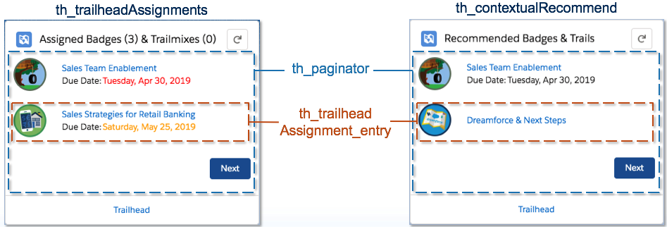

# Overview
This repository provides a number of Trail Tracker customizations allowing developers and admins to extend Trailhead and myTrailhead.

If you want to install this repository as a package in an org use the following URL: https://login.salesforce.com/packaging/installPackage.apexp?p0=04t2E000002dAih

If you installed previous versions of these packages or lightning compoments, completely remove the from your org by uninstalling the package AND deleting it from Setup > Installed Packages.

As a prerequisite be sure to have installed the latest version of the [Trail Tracker app](https://appexchange.salesforce.com/appxListingDetail?listingId=a0N3A00000EFpAtUAL) first.

# What is included
* <b>Lightning Web Components</b> to show Assignments and Recommendations for Badges and Trailmixes
* <b>Processes</b> for creating new assignments and recommendations (needs to be manually updated with Trailmix Ids)
* <b>Login Flow</b> with the Assignments Lightning Web Component (needs to be manually assigned to a Profile)
* <b>Custom object</b> to persist Recommendations
* <b>Aura wrapper</b> for the Assignment Lightning Web Component so it can be used with Lightning Out, Visualforce Pages and Flow
* <b>Apex classes</b> to retrieve Trailhead Assignments / Recommendations and test classes

## Assignment Component

* [th\_trailheadAssignments](dx/force-app/main/default/lwc/th_trailheadAssignments) - the Lightning Web Component that shows the list of assignments.
  * supports the following design attributes:
     * Badges or Trailmixes (Badge,TrailMix,Both) - type of entries to show
     * Page Size (Integer) - the number of records to show per page
     * Warning # days until due date (Integer) - Items within this many days will have orange due dates
  * [HTML - th\_trailheadAssignments](dx/force-app/main/default/lwc/th_trailheadAssignments/th_trailheadAssignments.html)
  * [JavaScript - th\_trailheadAssignments](dx/force-app/main/default/lwc/th_trailheadAssignments/th_trailheadAssignments.js)
  * [Metadata - th\_trailheadAssignments](dx/force-app/main/default/lwc/th_trailheadAssignments/th_trailheadAssignments.js-meta.xml)
  * [StyleSheets - th\_trailheadAssignments](dx/force-app/main/default/lwc/th_trailheadAssignments/th_trailheadAssignments.css)

## Recommendation Component
* [th\_contextualRecommend](dx/force-app/main/default/lwc/th_contextualRecommend) - the Lightning Web Component that shows the list of recommendations. On a lightning record page it will show recommendations specific to that record, on a home or app page it will show all recommendations.
  * supports the following design attributes:
     * Page Size (Integer) - the number of records to show per page
     * Warning # days until due date (Integer) - Items within this many days will have orange due dates

## Private components

* [th\_trailheadAssignment\_entry](dx/force-app/main/default/lwc/th_trailheadAssignment_entry/) - (private lwc component that represents a single badge or trailmix)
  * [HTML - th\_trailheadAssignment\_entry](dx/force-app/main/default/lwc/th_trailheadAssignment_entry/th_trailheadAssignment_entry.html)
  * [JavaScript - th\_trailheadAssignment\_entry](dx/force-app/main/default/lwc/th_trailheadAssignment_entry/th_trailheadAssignment_entry.js)
  * [Metadata - th\_trailheadAssignment\_entry](dx/force-app/main/default/lwc/th_trailheadAssignment_entry/th_trailheadAssignment_entry.js-meta.xml)

* [th\_paginator\_entry](dx/force-app/main/default/lwc/th_paginator_entry/) - (private lwc component that paginates a list of th_trailheadAssignment_entry's)

## Component Breakdown
Both the assignment and recommendation component leverage the private components

### Aura Component

To allow the Assignment component to be used in places where Lightning Web Components are not yet supported (like Lightning-Out and flow), we provide a 'Wrapper component' (written in aura).  It includes the LWC component and can be used in many more areas.

* [th\_trailheadAssignments\_wrap](dx/force-app/main/default/aura/th_trailheadAssignments_wrap) - Wrapper Component
  * [Component - th\_trailheadAssignments\_wrap](dx/force-app/main/default/aura/th_trailheadAssignments_wrap/th_trailheadAssignments_wrap.cmp)

## Lightning Out

* [TH\_Assignments](dx/force-app/main/default/pages/TH_Assignments.page) - Visualforce Page using Lightning Out
  * [th\_trailheadAssignments\_container](dx/force-app/main/default/aura/th_trailheadAssignments_container) - Application to allow the component to be used in Lightning Out.

## Custom Labels

To allow the component to be easier to extend, we have created three Custom Labels to allow customization without touching code.

<table>
    <tr>
        <th>Name</th>
        <th>Description</th>
        <th>Default Value</th>
    </tr>
    <tr>
        <td>th_trailhead_link_address</td>
        <td>Address to send users to when clicking the button at the bottom of the Trailhead Assignments component</td>
        <td>https://trailhead.salesforce.com/</td>
    </tr>
    <tr>
        <td>th_trailhead_link_label</td>
        <td>Label for the 'Trailhead' button at the bottom of the Trailhead Assignments component</td>
        <td>Traihead</td>
    </tr>
    <tr>
        <td>th_trailhead_trail_icon</td>
        <td>Icon to show when Trailmixes are assigned (as they have no icon)</td>
        <td width="50px">https://trailhead-web.s3.amazonaws.com/uploads/users/5396019/photos/thumb_030804d3576dab0cdc2a558055816208e421312a9d1495117d57928ef380d7f2.png?updatedAt=20180906113753</td>
    </tr></table>
    

